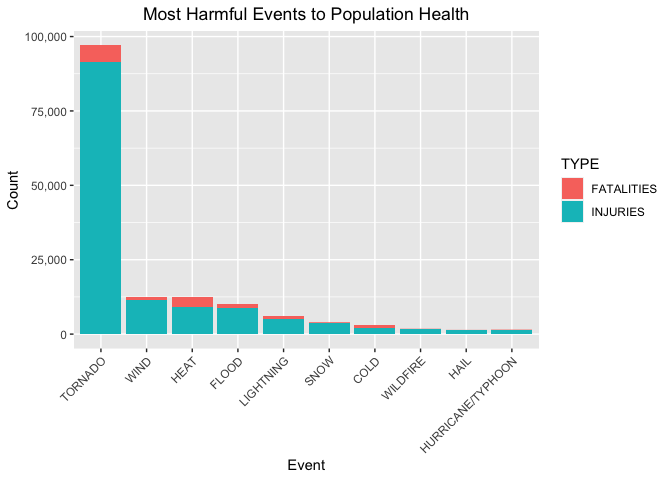
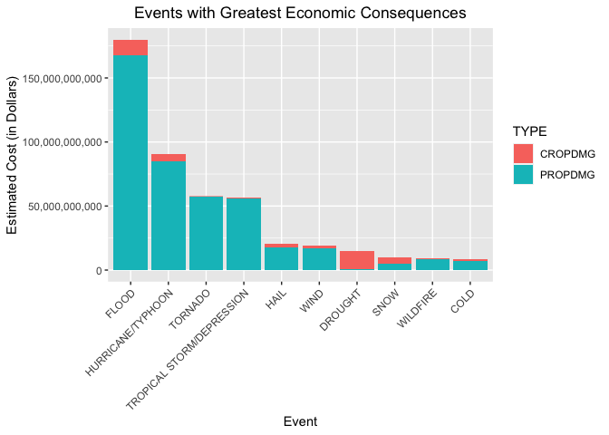

##**Synopsis**
This project was created to investigate the Storm Data made available by NOAA, and we are concerned in answering the following questions:

1. Across the United States, which types of events are most harmful with respect to population health?
2. Across the United States, which types of events have the greatest economic consequences?

The whole procedure consisted of the following steps: preprocessing of data, aggregation of the data, and plotting the data to check for trends. The *dplyr* and *tidyr* packages were used for cleaning and aggregation, while the *ggplot2* package was used for visualization.

The data at hand contains quite a big amount of information, so loading and processing it as is will take quite some time. To resolve this, the data was reduced to include only the columns that were needed, specifically *EVTYPE*, *FATALITIES*, *INJURIES*, *PROPDMG*, *PRPDMGEXP*, *CROPDMG*, and *CROPDMGEXP*, corresponding respectively to the event type, fatality and injury counts, estimated property and crop damages. The property and crop damages were stored in two separate columns each, in actual digits and in units, so a simple conversion algorithm was created in order make this data useful. Then, empty rows were removed, and event types were regrouped in order to catch misspelled event types that were falsely listed separately.

We found out that the most harmful event for human health was *tornado*, while the most economically impactful event was *flood*.

##**Data Processing**

The procedures in this study used *dplyr*, *tidyr*, and *ggplot2* packages in *R*. Make sure these packages were already downloaded with the *install.packages()* command to avoid errors when rerunning the steps.


```r
#Loading necessary libraries
library(dplyr)
library(tidyr)
library(ggplot2)
```

Data was then stored in a data framr using the function *read.csv()*.

```r
#Reading the data and storing in a data frame
data <- read.csv("repdata_data_StormData.csv.bz2")
```

A subset of the original data was taken in order to lessen the computation time. We are only interested in the columns that will give us the fatalities, injuries, property and crop damage estimates per event type. The data for getting accumulated fatalities, injuries, and property damages across the US were stored in a data frame *refdata*.


```r
#Data frame to store event type, fatalities, injuries, crop and property damage estimates
#The ifelse command converts the EXP codes into actual numbers
refdata <- data %>% 
     mutate(PROPDMGEXP = 
                 ifelse(PROPDMGEXP == "B", 1000000000,
                 ifelse(PROPDMGEXP == "M", 1000000,
                 ifelse(PROPDMGEXP == "K", 1000, 0)))) %>%
     mutate(PROPDMG = PROPDMG*PROPDMGEXP) %>%
     mutate(CROPDMGEXP = 
                 ifelse(CROPDMGEXP == "B", 1000000000,
                 ifelse(CROPDMGEXP == "M", 1000000,
                 ifelse(CROPDMGEXP == "K", 1000, 0)))) %>%
     mutate(CROPDMG = CROPDMG*CROPDMGEXP) %>%
     select(EVTYPE, FATALITIES, INJURIES, PROPDMG, CROPDMG)
```

*refdata* was further cleaned by removing rows that give no additional value (rows where all columns are zero), and renaming misspelled *EVTYPE* inputs. Because there were various identifiers given to the same event types, the cleaning process also involved grouping the events into umbrella names that captured such events into one identifier. Following the *Storm Data Event Table*, Table 1 of section 2.1.1 on page 6 of the [NWS Storm Data Documentation](https://d396qusza40orc.cloudfront.net/repdata%2Fpeer2_doc%2Fpd01016005curr.pdf), *EVTYPE* variable was reduced to a factor with 36 levels. The original list contained 48 events, but some events were repeating and/or highly similar, so regrouping seemed necessary.


```r
#Removing rows with no damage, fatality, or casualty value (zero rows)
refdata <- filter_at(refdata, vars(2:5), any_vars(. != 0))

#Temporarily setting EVYTPE as character for string comparisons using grepl
refdata$EVTYPE <- as.character(refdata$EVTYPE)

#Renaming and regrouping data accordingly to eradicate misspellings and lapses in the recorded data
refdata$EVTYPE[grepl("LOW\\sTIDE", refdata$EVTYPE, ignore.case = TRUE)] <- "LOW TIDE"
refdata$EVTYPE[grepl("AVALAN", refdata$EVTYPE, ignore.case = TRUE)] <- "AVALANCHE"
refdata$EVTYPE[grepl("BLIZZARD", refdata$EVTYPE, ignore.case = TRUE)] <- "BLIZZARD"
refdata$EVTYPE[grepl("FLOOD|FLD|STREAM|URBAN|RISING", refdata$EVTYPE, ignore.case = TRUE)] <- "FLOOD"
refdata$EVTYPE[grepl("COLD|WIND\\sCHILL|COOL|WINTER|WINDCHILL|HYPOTHERMIA|LOW\\sTEMP", refdata$EVTYPE, ignore.case = TRUE)] <- "COLD"
refdata$EVTYPE[grepl("FOG", refdata$EVTYPE, ignore.case = TRUE)] <- "FOG"
refdata$EVTYPE[grepl("SMOKE", refdata$EVTYPE, ignore.case = TRUE)] <- "SMOKE"
refdata$EVTYPE[grepl("DROUGHT|DOUGHT", refdata$EVTYPE, ignore.case = TRUE)] <- "DROUGHT"
refdata$EVTYPE[grepl("DUST", refdata$EVTYPE, ignore.case = TRUE)] <- "DUST"
refdata$EVTYPE[grepl("HEAT|WARM|HYPERTHERMIA", refdata$EVTYPE, ignore.case = TRUE)] <- "HEAT"
refdata$EVTYPE[grepl("FROST|FREEZE", refdata$EVTYPE, ignore.case = TRUE)] <- "FREEZE"
refdata$EVTYPE[grepl("HAIL", refdata$EVTYPE, ignore.case = TRUE)] <- "HAIL"
refdata$EVTYPE[grepl("RAIN|WETNESS|PRECIPITATION|SWELL|SHOWER", refdata$EVTYPE, ignore.case = TRUE)] <- "RAIN"
refdata$EVTYPE[grepl("SNOW|ICE|DRIZZLE|FREEZING|GLAZE|ICY", refdata$EVTYPE, ignore.case = TRUE)] <- "SNOW"
refdata$EVTYPE[grepl("HIGH\\sTIDE|SURF|HIGH\\sWATER|HIGH\\sSEA", refdata$EVTYPE, ignore.case = TRUE)] <- "HIGH TIDE/SURF"
refdata$EVTYPE[grepl("TSTM|THUNDERSTORM", refdata$EVTYPE, ignore.case = TRUE)] <- "THUNDERSTORM_WIND"
refdata$EVTYPE[grepl("WIND|DOWNBURST|MICROBURST|GRADIENT|GUST|TURBULENCE", refdata$EVTYPE, ignore.case = TRUE)] <- "WIND"
refdata$EVTYPE[grepl("HURRICANE|TYPHOON", refdata$EVTYPE, ignore.case = TRUE)] <- "HURRICANE/TYPHOON"
refdata$EVTYPE[grepl("ICE\\sSTORM", refdata$EVTYPE, ignore.case = TRUE)] <- "ICE STORM"
refdata$EVTYPE[grepl("LIGHTNING|LIGNTNING|LIGHTING", refdata$EVTYPE, ignore.case = TRUE)] <- "LIGHTNING"
refdata$EVTYPE[grepl("RIP\\sCURRENT", refdata$EVTYPE, ignore.case = TRUE)] <- "RIP CURRENT"
refdata$EVTYPE[grepl("SEICHE", refdata$EVTYPE, ignore.case = TRUE)] <- "SEICHE"
refdata$EVTYPE[grepl("SLEET", refdata$EVTYPE, ignore.case = TRUE)] <- "SLEET"
refdata$EVTYPE[grepl("SURGE", refdata$EVTYPE, ignore.case = TRUE)] <- "STORM SURGE"
refdata$EVTYPE[grepl("TORNADO|TORNDAO", refdata$EVTYPE, ignore.case = TRUE)] <- "TORNADO"
refdata$EVTYPE[grepl("EROSION", refdata$EVTYPE, ignore.case = TRUE)] <- "COASTAL EROSION"
refdata$EVTYPE[grepl("TROPICAL|STORM", refdata$EVTYPE, ignore.case = TRUE)] <- "TROPICAL STORM/DEPRESSION"
refdata$EVTYPE[grepl("TSUNAMI", refdata$EVTYPE, ignore.case = TRUE)] <- "TSUNAMI"
refdata$EVTYPE[grepl("WATERSPOUT", refdata$EVTYPE, ignore.case = TRUE)] <- "WATERSPOUT"
refdata$EVTYPE[grepl("FIRE", refdata$EVTYPE, ignore.case = TRUE)] <- "WILDFIRE"
refdata$EVTYPE[grepl("SLIDE|SLUMP", refdata$EVTYPE, ignore.case = TRUE)] <- "LAND/MUD/ROCK SLIDE"
refdata$EVTYPE[grepl("HEAVY\\sSEAS|WAVE|SEAS", refdata$EVTYPE, ignore.case = TRUE)] <- "WAVES"
refdata$EVTYPE[grepl("WINTRY|HEAVY\\sMIX|MIXED", refdata$EVTYPE, ignore.case = TRUE)] <- "WITRY MIX"
refdata$EVTYPE[grepl("ACCIDENT|MISHAP|DROWN|OTHER|\\?|APACHE", refdata$EVTYPE, ignore.case = TRUE)] <- "OTHERS"

#Restoring EVTYPE as factor      
refdata$EVTYPE<-as.factor(refdata$EVTYPE)

#Merging rows of the same event
refdata <- refdata %>% 
      group_by(EVTYPE) %>% 
      summarise(FATALITIES = sum(FATALITIES), INJURIES = sum(INJURIES), PROPDMG = sum(PROPDMG), CROPDMG = sum(CROPDMG))

#Showing the summary of the data frame
glimpse(refdata)
```

```
## Rows: 36
## Columns: 5
## $ EVTYPE     <fct> AVALANCHE, BLIZZARD, COASTAL EROSION, COLD, DAM BREAK…
## $ FATALITIES <dbl> 225, 101, 0, 761, 0, 6, 24, 1554, 80, 2, 0, 45, 3173,…
## $ INJURIES   <dbl> 171, 805, 0, 2216, 0, 19, 483, 8683, 1076, 3, 3, 1467…
## $ PROPDMG    <dbl> 8721800, 659913950, 866000, 7024179700, 1002000, 1046…
## $ CROPDMG    <dbl> 0, 112060000, 0, 1486209550, 0, 13972621780, 3600000,…
```

##**Results**
The data for health effects was transformed through this code block. Only the top 10 events in terms of total fatalities and injurues were included in the graph.

```r
health <- refdata %>% 
      mutate(HLTH = INJURIES + FATALITIES) %>% 
      arrange(desc(HLTH)) %>%
      top_n(10) %>%
      select(EVTYPE, FATALITIES, INJURIES) %>%
      gather(key = "TYPE", value = "VALUE", FATALITIES:INJURIES)
```

Generating the plot for 10 most harmful events in terms of human health:

```r
ggplot(health, aes(x = reorder(EVTYPE,-VALUE), y = VALUE, fill = TYPE)) + 
      geom_bar(stat = "identity") + 
      labs(title = "Most Harmful Events to Population Health", x="Event", y="Count") +
      theme(plot.title = element_text(hjust = 0.5), axis.text.x = element_text(angle=45, hjust=1)) + 
      scale_y_continuous(labels = scales::comma)
```

<!-- -->

We found out that **the most harmful event for human health was tornado**, followed by (strong) wind, heat, flood, and lightning. We may notice that most of the events in the top 10, at least in terms of human health, were events related to changes in weather.

The data for economic consequences was transformed through this code block. Only the top 10 events in terms of total crop and property damages were included in the graph.

```r
damage <- refdata %>% 
      mutate(DMG = PROPDMG + CROPDMG) %>% 
      arrange(desc(DMG)) %>%
      top_n(10) %>%
      select(EVTYPE, PROPDMG, CROPDMG) %>%
      gather(key = "TYPE", value = "VALUE", PROPDMG:CROPDMG)
```

Generating the plot for 10 most economically impactful events:

```r
ggplot(damage, aes(x = reorder(EVTYPE,-VALUE), y = VALUE, fill = TYPE)) + 
      geom_bar(stat = "identity") + 
      labs(title = "Events with Greatest Economic Consequences", x="Event", y="Estimated Cost (in Dollars)") +
      theme(plot.title = element_text(hjust = 0.5), axis.text.x = element_text(angle=45, hjust=1)) +
      scale_y_continuous(labels = scales::comma)
```

<!-- -->

We found out that **the most harmful event economically was flood**, followed by hurricane/typhoon, tornado, tropical storm/deression, and hail. We may notice that most of the events in the top 10 for the economical category are still consequences of changes in weather.
